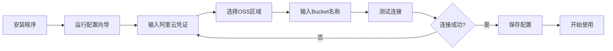
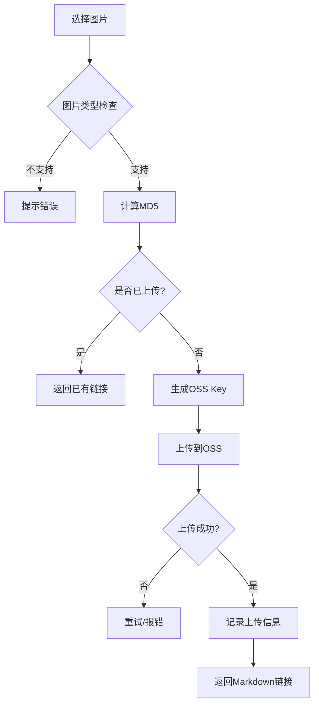
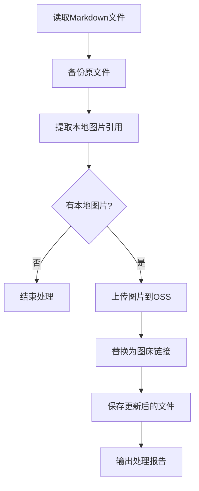

# 阿里云OSS图床系统 PRD文档

## 📋 文档信息

| 项目名称 | 阿里云OSS图床系统 |
|---------|------------------|
| 文档版本 | v1.0 |
| 创建日期 | 2025-11-05 |
| 文档状态 | 待评审 |
| 产品负责人 | - |

## 1. 项目概述

### 1.1 项目背景

随着Markdown文档编写的普及，图片管理成为了技术写作者、博客作者的痛点问题：

- **本地图片问题**：Markdown文档使用本地图片路径，分享文档时图片无法正常显示
- **平台迁移困难**：从一个平台迁移到另一个平台时，图片链接全部失效
- **图片管理混乱**：多平台写作时，图片分散在各处，难以统一管理
- **盗链风险**：使用第三方免费图床存在盗链、服务关闭等风险

### 1.2 产品定位

基于阿里云OSS构建的**个人/团队图床管理系统**，提供：

- 本地图片一键上传至阿里云OSS
- 自动生成Markdown格式的图床链接
- 支持批量处理和命令行操作
- 低成本、高可靠的图片存储方案

### 1.3 核心价值

- **成本低廉**：阿里云OSS按量计费，个人使用年费约10-50元
- **稳定可靠**：阿里云基础设施保障，99.99%可用性
- **统一管理**：所有图片集中存储，便于管理和迁移
- **一键转换**：本地路径自动转换为Markdown图床链接

## 2. 目标用户

### 2.1 主要用户群体

| 用户类型 | 使用场景 | 痛点 |
|---------|---------|------|
| 技术博主 | 撰写技术博客，需要插入大量截图和示意图 | 图片管理混乱，跨平台发布图片失效 |
| 产品经理 | 编写PRD文档，需要插入产品原型和流程图 | 文档分享时图片路径问题 |
| 开发者 | GitHub README、技术文档编写 | 需要稳定的图床支持文档图片 |
| 内容创作者 | 公众号、知乎等平台发布 | 多平台发布需要重复上传图片 |

### 2.2 用户画像

**典型用户A - 技术博主**
- 年龄：25-35岁
- 职业：软件工程师
- 需求：每周发布2-3篇技术博客，每篇包含5-10张图片
- 痛点：在CSDN、掘金、博客园多平台发布，需要重复处理图片

**典型用户B - 产品经理**
- 年龄：28-40岁
- 职业：产品经理
- 需求：日常使用Markdown编写PRD文档
- 痛点：文档分享给团队时，本地图片无法显示

## 3. 功能需求

### 3.1 核心功能

#### 3.1.1 图片上传功能

**功能描述**：将本地图片上传到阿里云OSS，并返回访问链接

**输入**：
- 本地图片文件路径（绝对路径或相对路径）
- 支持格式：png, jpg, jpeg, gif, svg, webp

**输出**：
- 阿里云OSS图片访问URL
- Markdown格式链接：``

**业务规则**：
- 图片自动重命名（UUID + 原始扩展名）
- 支持自定义存储路径前缀
- 自动检测并跳过已上传的图片（基于文件MD5）
- 上传失败自动重试（最多3次）

#### 3.1.2 批量上传功能

**功能描述**：批量上传多张图片，支持文件夹扫描

**输入**：
- 图片文件夹路径
- 图片文件路径列表

**输出**：
- 所有图片的Markdown链接列表
- 上传成功/失败统计报告

**业务规则**：
- 递归扫描子文件夹
- 过滤非图片文件
- 并发上传（默认5个并发）
- 进度条显示

#### 3.1.3 Markdown文档处理

**功能描述**：扫描Markdown文档，自动上传本地图片并替换为图床链接

**输入**：
- Markdown文件路径
- 或包含多个Markdown文件的文件夹

**输出**：
- 更新后的Markdown文件（原文件备份）
- 图片上传记录

**业务规则**：
- 识别Markdown中的本地图片引用：``
- 自动上传本地图片
- 替换为图床链接
- 保留原文件备份（.bak后缀）

#### 3.1.4 配置管理

**功能描述**：管理阿里云OSS访问凭证和上传配置

**配置项**：
```yaml
aliyun:
  access_key_id: "your-access-key-id"
  access_key_secret: "your-access-key-secret"
  endpoint: "oss-cn-beijing.aliyuncs.com"
  bucket_name: "your-bucket-name"
  
upload:
  path_prefix: "images/{year}/{month}/"  # 上传路径前缀
  enable_md5_check: true                 # 启用MD5去重
  concurrent_limit: 5                    # 并发上传数
  retry_times: 3                         # 重试次数
  
markdown:
  backup_original: true                  # 是否备份原文件
  image_alt_text: "image"               # 默认图片描述文字
```

### 3.2 辅助功能

#### 3.2.1 图片管理

- 列出OSS上已上传的图片
- 删除指定图片
- 查看图片上传记录

#### 3.2.2 使用统计

- 上传图片数量统计
- 存储空间占用
- 流量使用情况
- 费用估算

#### 3.2.3 命令行工具

提供CLI命令行工具，支持：
```bash
# 上传单张图片
oss-image upload /path/to/image.png

# 批量上传
oss-image upload-batch /path/to/images/

# 处理Markdown文档
oss-image convert /path/to/document.md

# 查看配置
oss-image config show

# 查看统计
oss-image stats
```

## 4. 技术方案

### 4.1 技术栈选型

| 技术项 | 选型 | 说明 |
|--------|------|------|
| 开发语言 | Python 3.8+ | 丰富的OSS SDK，易于开发 |
| OSS SDK | aliyun-python-sdk-oss | 阿里云官方SDK |
| CLI框架 | Click | 优秀的命令行工具框架 |
|配置管理 | YAML | 易读易写的配置格式 |
| 进度显示 | tqdm | 美观的进度条 |
| 并发处理 | concurrent.futures | Python标准库 |

### 4.2 系统架构

```
┌─────────────────────────────────────────┐
│           用户交互层                     │
│  (CLI命令 / Python SDK / Web界面)       │
└────────────────┬────────────────────────┘
                 │
┌────────────────▼────────────────────────┐
│          业务逻辑层                      │
│  ┌──────────┐  ┌──────────┐  ┌───────┐ │
│  │图片上传  │  │Markdown  │  │配置   │ │
│  │  模块    │  │  处理    │  │管理   │ │
│  └──────────┘  └──────────┘  └───────┘ │
└────────────────┬────────────────────────┘
                 │
┌────────────────▼────────────────────────┐
│         OSS服务层                        │
│  ┌──────────────────────────────────┐   │
│  │   阿里云OSS Python SDK            │   │
│  └──────────────────────────────────┘   │
└────────────────┬────────────────────────┘
                 │
┌────────────────▼────────────────────────┐
│         阿里云OSS对象存储                │
└─────────────────────────────────────────┘
```

### 4.3 核心模块设计

#### 4.3.1 图片上传模块（ImageUploader）

```python
class ImageUploader:
    """图片上传核心类"""
    
    def __init__(self, config):
        """初始化OSS客户端"""
        pass
    
    def upload_single(self, local_path: str) -> dict:
        """上传单张图片
        
        Args:
            local_path: 本地图片路径
            
        Returns:
            {
                'success': True,
                'url': 'https://xxx.oss-cn-beijing.aliyuncs.com/xxx.png',
                'markdown': '',
                'md5': 'xxx',
                'size': 102400
            }
        """
        pass
    
    def upload_batch(self, image_paths: List[str]) -> List[dict]:
        """批量上传图片"""
        pass
    
    def _generate_oss_key(self, local_path: str) -> str:
        """生成OSS存储路径"""
        pass
    
    def _calculate_md5(self, file_path: str) -> str:
        """计算文件MD5"""
        pass
```

#### 4.3.2 Markdown处理模块（MarkdownProcessor）

```python
class MarkdownProcessor:
    """Markdown文档处理类"""
    
    def __init__(self, uploader: ImageUploader):
        """初始化"""
        pass
    
    def process_file(self, md_path: str) -> dict:
        """处理单个Markdown文件
        
        Args:
            md_path: Markdown文件路径
            
        Returns:
            {
                'success': True,
                'processed_images': 5,
                'failed_images': 0,
                'backup_path': '/path/to/file.md.bak'
            }
        """
        pass
    
    def _extract_local_images(self, content: str) -> List[str]:
        """提取本地图片路径"""
        pass
    
    def _replace_image_links(self, content: str, 
                           replacements: dict) -> str:
        """替换图片链接"""
        pass
```

### 4.4 数据库设计（可选）

**上传记录表（upload_records）**

| 字段名 | 类型 | 说明 |
|--------|------|------|
| id | INTEGER | 主键 |
| local_path | TEXT | 本地路径 |
| oss_url | TEXT | OSS访问URL |
| oss_key | TEXT | OSS对象键 |
| file_md5 | TEXT | 文件MD5 |
| file_size | INTEGER | 文件大小（字节） |
| upload_time | TIMESTAMP | 上传时间 |
| status | TEXT | 状态（success/failed） |

## 5. 使用流程

### 5.1 初次配置流程



### 5.2 图片上传流程



### 5.3 Markdown文档处理流程



## 6. 接口设计

### 6.1 Python SDK接口

```python
from oss_image_bed import OSSImageBed

# 初始化
client = OSSImageBed(config_path='~/.oss_config.yaml')

# 上传单张图片
result = client.upload_image('/path/to/image.png')
# 返回: {
#     'url': 'https://...',
#     'markdown': '',
#     'success': True
# }

# 批量上传
results = client.upload_images([
    '/path/to/image1.png',
    '/path/to/image2.jpg'
])

# 处理Markdown文档
report = client.process_markdown('/path/to/document.md')

# 获取统计信息
stats = client.get_stats()
```

### 6.2 CLI命令接口

```bash
# 初始化配置
oss-image init

# 上传单张图片
oss-image upload <image_path>
oss-image upload /Users/rick/screenshot.png

# 批量上传
oss-image upload-batch <folder_path>
oss-image upload-batch /Users/rick/images/

# 处理Markdown文档
oss-image convert <markdown_path>
oss-image convert README.md
oss-image convert docs/  # 处理整个文件夹

# 查看配置
oss-image config show
oss-image config set endpoint oss-cn-beijing.aliyuncs.com

# 查看上传记录
oss-image list --limit 10

# 查看统计
oss-image stats

# 删除图片
oss-image delete <oss_key>
```

## 7. 非功能性需求

### 7.1 性能需求

- 单张图片上传时间 < 3秒（1MB图片）
- 批量上传支持并发，提升50%效率
- Markdown文档处理速度 > 100张图片/分钟

### 7.2 安全需求

- AccessKey加密存储在本地配置文件
- 支持通过环境变量配置敏感信息
- OSS Bucket建议开启私有读写，通过签名URL访问
- 配置文件权限检查（仅用户可读写）

### 7.3 可靠性需求

- 上传失败自动重试机制
- 网络异常时的错误提示和恢复建议
- 完整的日志记录（默认保存在~/.oss_image_bed/logs/）
- 原始文件自动备份，防止数据丢失

### 7.4 易用性需求

- 提供详细的安装和配置文档
- 友好的错误提示信息
- 进度条显示上传进度
- 支持配置向导（交互式配置）

## 8. 配置说明

### 8.1 阿里云OSS准备

**步骤1：开通OSS服务**
1. 登录阿里云控制台
2. 开通对象存储OSS服务
3. 选择按量付费模式

**步骤2：创建Bucket**
1. 进入OSS管理控制台
2. 创建Bucket，选择区域（建议选择距离近的区域）
3. 权限设置：
   - 读写权限：私有（推荐）或公共读
   - 服务端加密：可选

**步骤3：获取AccessKey**
1. 点击用户头像 → AccessKey管理
2. 创建AccessKey（建议使用RAM子账号）
3. 记录AccessKey ID和AccessKey Secret

### 8.2 配置文件说明

配置文件位置：`~/.oss_image_bed/config.yaml`

```yaml
# 阿里云OSS配置
aliyun:
  access_key_id: "LTAI5tXXXXXXXXXXXXXX"
  access_key_secret: "3vXXXXXXXXXXXXXXXXXXXXXXXXXX"
  endpoint: "oss-cn-beijing.aliyuncs.com"
  bucket_name: "my-image-bed"
  # 可选：自定义域名（绑定后使用）
  custom_domain: "https://img.yourdomain.com"

# 上传配置
upload:
  # 路径前缀，支持变量: {year}, {month}, {day}
  path_prefix: "images/{year}/{month}/"
  
  # 文件命名规则: uuid, timestamp, original
  naming_rule: "uuid"
  
  # 是否启用MD5去重
  enable_md5_check: true
  
  # 并发上传数量
  concurrent_limit: 5
  
  # 失败重试次数
  retry_times: 3
  
  # 支持的图片格式
  allowed_formats: [".png", ".jpg", ".jpeg", ".gif", ".svg", ".webp"]

# Markdown处理配置  
markdown:
  # 是否备份原文件
  backup_original: true
  
  # 备份文件后缀
  backup_suffix: ".bak"
  
  # 默认图片描述
  image_alt_text: "image"
  
  # 是否递归处理子文件夹
  recursive: true

# 日志配置
logging:
  # 日志级别: DEBUG, INFO, WARNING, ERROR
  level: "INFO"
  
  # 日志文件路径
  file_path: "~/.oss_image_bed/logs/app.log"
  
  # 日志文件最大大小（MB）
  max_size: 10
  
  # 保留的日志文件数量
  backup_count: 5
```

## 9. 费用估算

### 9.1 阿里云OSS费用构成

| 费用项 | 计费方式 | 参考价格（华北2-北京） |
|--------|----------|----------------------|
| 存储费用 | 按GB/月 | 0.12元/GB/月 |
| 流量费用 | 按GB | 外网流出流量 0.50元/GB |
| 请求费用 | 按次数 | GET请求 0.01元/万次 |

### 9.2 典型使用场景费用

**个人博客场景**
- 存储：500张图片，平均200KB，约100MB = 0.012元/月
- 流量：月访问1000次，每次加载10张图片 = 2GB = 1元/月
- 请求：10000次GET = 0.01元/月
- **月费用合计：约1-2元**

**技术博主场景**
- 存储：2000张图片，约500MB = 0.06元/月  
- 流量：月访问5000次 = 10GB = 5元/月
- **月费用合计：约5-6元**

### 9.3 成本优化建议

1. 开启CDN加速可降低流量费用
2. 使用图片压缩减少存储和流量
3. 设置生命周期规则，自动删除过期图片
4. 选择距离近的区域减少延迟

## 10. 后续规划

### 10.1 Version 1.0（MVP）

- ✅ 基础图片上传功能
- ✅ Markdown文档处理
- ✅ CLI命令行工具
- ✅ 配置管理

### 10.2 Version 1.1

- 📋 Web可视化管理界面
- 📋 图片压缩功能
- 📋 历史记录管理（SQLite）
- 📋 批量下载功能

### 10.3 Version 2.0

- 📋 支持其他云服务商（腾讯云COS、七牛云）
- 📋 图片CDN加速配置
- 📋 团队协作功能
- 📋 浏览器插件（右键上传）
- 📋 Typora/VSCode插件集成

## 11. 附录

### 11.1 参考资料

- [阿里云OSS Python SDK文档](https://help.aliyun.com/document_detail/32026.html)
- [Markdown语法规范](https://www.markdownguide.org/)
- [Click命令行框架](https://click.palletsprojects.com/)

### 11.2 常见问题

**Q1: 上传失败怎么办？**
A: 检查网络连接、AccessKey配置、Bucket权限设置

**Q2: 如何备份图片？**  
A: 可以定期使用`oss-image backup`命令将OSS图片下载到本地

**Q3: 支持哪些图片格式？**
A: 默认支持 png, jpg, jpeg, gif, svg, webp，可在配置文件中自定义

**Q4: 如何删除OSS上的图片？**
A: 使用`oss-image delete <oss_key>`命令

### 11.3 技术支持

- GitHub Issues: https://github.com/xxx/oss-image-bed/issues
- 使用文档: https://xxx.github.io/oss-image-bed
- Email: support@example.com

---

**文档结束**
